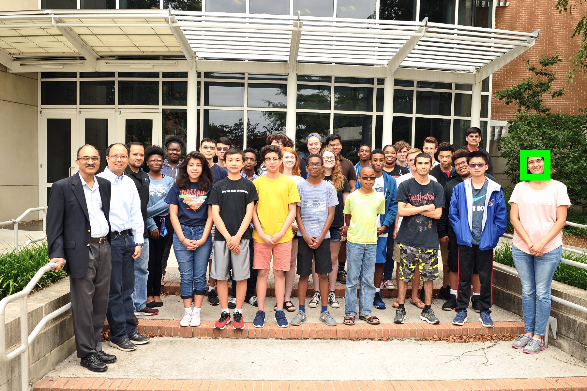

# [Face Recognition](https://www.nehaniphadkar.in/FacialRecognitionWithCode/facerecognition/)

This tutorial uses Python and related libraries [Face Recognition](https://github.com/ageitgey/face_recognition), [NumPy](https://numpy.org/), and [Pillow](https://pillow.readthedocs.io/en/stable/) to detect a face in an image or group of images.

## Part 1 : Detecting 1 Person Amongst Many

First image used to train

Face detected amongst many

Second image used to train along with first one

Faces detected amongst many

In the above image, only Dr. Ravi Mukkamala's face and my face has our names under them, all other faces are labelled as unknown. You can run the attached notebook in either Anaconda or Google Colab and try the codes for yourself. All the necessary libraries to run it successfully are mentioned in the notebook.

Happy Learning 📜
